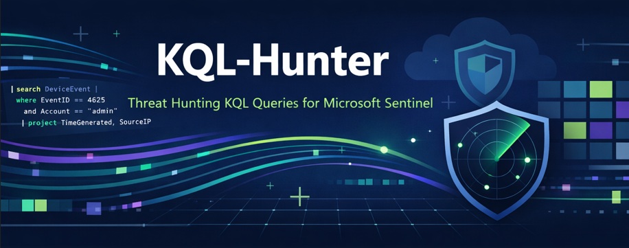
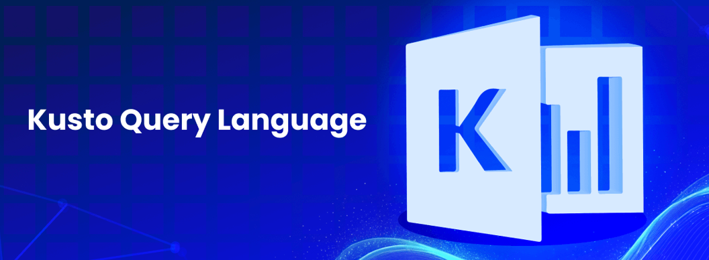
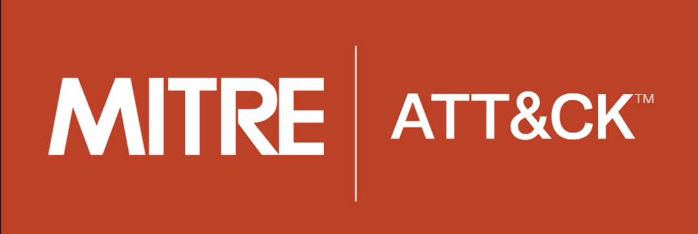

# KQL-Hunter
**A curated collection of advanced KQL threat-hunting queries for Microsoft Sentinel, aligned with the MITRE ATT&CK framework**



---

## Overview

**KQL Hunter** is an open-source repository of **Kusto Query Language (KQL) hunting queries** for **Microsoft Sentinel**, enriched with **MITRE ATT&CK mappings**. It provides a curated set of ready-to-use hunting queries, organized by domain (Endpoints, Network, Cloud, etc.) and mapped to MITRE ATT&CK techniques.

Whether you are a security analyst, cyber enthusiast, or Purple Team practitioner, KQL Hunter helps you **detect threats**, **practice detection scenarios**, **build SOC use-cases**, and **learn threat hunting** with a structured, practical approach aligned to real-world attacks.

---

## Introducing KQL



**[KQL (Kusto Query Language)](https://learn.microsoft.com/en/kusto/query/?view=microsoft-fabric)** is the query language for **Azure Log Analytics** and **Microsoft Sentinel**. It allows you to efficiently search and analyze structured log data for insights and threat hunting.  

**Example KQL Query:**

```kql
SecurityEvent
| where EventID == 4625
| summarize count() by Account, bin(TimeGenerated, 1h)
| order by count_
```

---

## Microsoft Sentinel


**[Microsoft Sentinel](https://www.microsoft.com/en/security/business/siem-and-xdr/microsoft-sentinel)** is a **cloud-native SIEM/SOAR** that **uses KQL to analyze logs** across your environment.

With KQL Hunter, you can:

- Detect suspicious behavior
- Build correlation rules
- Map queries to MITRE ATT&CK tactics
- Share and collaborate on hunting techniques

---

## MITRE ATT&CK Framework



**[MITRE ATT&CK](https://attack.mitre.org)** is a globally adopted knowledge base of **adversary tactics**, **techniques**, and **procedures (TTPs)** based on real-world attacks.

KQL Hunter aligns each hunting query with relevant MITRE ATT&CK tactics and techniques, enabling defenders to:

- Understand attacker behavior
- Map detections to adversary techniques
- Improve threat coverage and reporting
- Support Purple Team and threat modeling activities

Each query includes references such as:

- **Tactic** (e.g., Initial Access, Execution)
- **Technique ID** (e.g., T1059)
- **Technique name**

---

## Project Structure

The repository is organized to be **simple**, **scalable**, and **contribution-friendly**.

```text
KQL-Hunter/
├── queries/
│   ├── ta0001-initial-access/
│   ├── ta0002-execution/
│   ├── ta0003-persistence/
│   ├── ta0004-privilege-escalation/
│   ├── ta0005-defense-evasion/
│   ├── ta0006-credential-access/
│   ├── ta0007-discovery/
│   ├── ta0008-lateral-movement/
│   ├── ta0009-collection/
│   ├── ta0010-exfiltration/
│   └── ta0011-command-and-control/
├── docs/
│   ├── KQL-Hunter.png
│   ├── KQL.png
│   ├── Microsoft-Sentinel.png
│   └── MITRE.png
├── README.md
└── LICENSE
```

---

## MITRE ATT&CK Coverage

Each folder under `queries/` represents a MITRE ATT&CK tactic and contains related KQL hunting queries.

| MITRE ATT&CK Tactic  | Folder Name             | Description                                    |
| -------------------- | ----------------------- | ---------------------------------------------- |
| Initial Access       | [`ta0001-initial-access/`](/queries/ta0001-initial-access/README.md) | Detect phishing, brute-force, exposed services|
| Execution            | [`ta0002-execution/`](/queries/ta0002-execution/README.md)     | PowerShell, CMD, script execution              |
| Persistence          | [`ta0003-persistence/`](/queries/ta0003-persistence/README.md)   | Registry, scheduled tasks, startup abuse       |
| Privilege Escalation | [`ta0004-privilege-escalation/`](/queries/ta0004-privilege-escalation/README.md) | UAC bypass, token abuse                 |
| Defense Evasion      | [`ta0005-defense-evasion/`](/queries/ta0005-defense-evasion/README.md)      | Obfuscation, logging disable            |
| Credential Access    | [`ta0006-credential-access/`](/queries/ta0006-credential-access/README.md)    | LSASS, password spraying                |
| Discovery            | [`ta0007-discovery/`](/queries/ta0007-discovery/README.md)     | Network, account, system discovery             |
| Lateral Movement     | [`ta0008-lateral-movement/`](/queries/ta0008-lateral-movement/README.md)     | SMB, RDP, remote execution              |
| Collection            | [`ta0009-collection/`](/queries/ta0009-collection/README.md)       | Screen capture, clipboard, data staging |
| Exfiltration         | [`ta0010-exfiltration/`](/queries/ta0010-exfiltration/README.md)         | Data transfer anomalies                 |
| Command and Control  | [`ta0011-command-and-control/`](/queries/ta0011-command-and-control/README.md)  | Beaconing, suspicious outbound traffic  |

---

## Query Format & Metadata

Each KQL file follows a **standard structure** to ensure consistency and clarity:

```kql
// Title: Suspicious PowerShell Execution
// Description: Detects encoded or obfuscated PowerShell commands
// Data Source: DeviceProcessEvents
// MITRE ATT&CK:
//   Tactic: Execution
//   Technique: T1059.001 - PowerShell
// Severity: Medium

DeviceProcessEvents
| where FileName =~ "powershell.exe"
| where ProcessCommandLine contains "-enc"
```

---

## License

This project is licensed under the **[MIT License](LICENSE)**.
You are free to use, modify, and share it with proper attribution.
